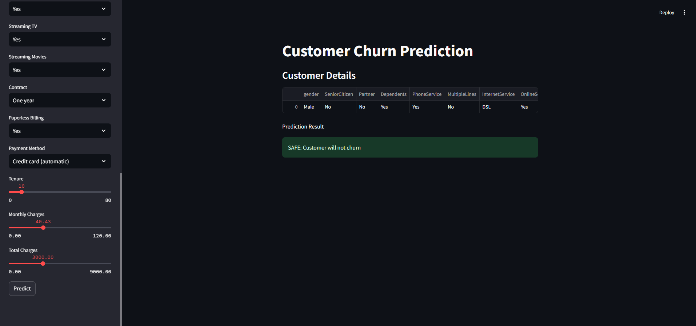

# Customer-Churn-Prediction
An end-to-end customer churn prediction project that aims to predict customer churn based on various features.

## EDA
* Analyzed categorical and numerical features to identify patterns in customer churn.
* Used count plots and KDE plots to visualize churn distribution.
* Observations:
    - senior citizens churn more (~80%) -> Indicates age could influence churn.
    - customers with fiber optic churn more (~70%) -> Internet type plays a major role.
    - customers with no online security, backup, or tech support have high churn (~70%) -> Security and support services impact retention.
    - electronic check payments have the highest churn (~80%) -> Certain payment methods are risk factors.
    - higher monthly charges lead to more churn -> Pricing strategy optimization needed
    - tenure is inversely related to churn ->  Long-term customers tend to stay.

## Preprocessing
* Feature Scaling: Standardized numerical features to prevent model bias.
* One-Hot Encoding: Converted categorical variables for machine learning compatibility.
* Class Imbalance Handling:
    * SMOTE: Synthetic data generation for minority class.
    * Random Undersampling: Balanced classes to prevent bias.

## Model Training and Performance
* Logistic Regression - baseline model used for comparsion
* Decision Tree Classifier – Captures non-linearity but prone to overfitting
* Random Forest Classifier – Best recall with robust generalization
* Support Vector Machine (SVM) – Effective in high-dimensional space

## Results
* Best Model: Random Forest Classifier (with Downsampling)
    * Threshold Tuning: Adjusted probability cut-off to 0.44 to optimize recall while balancing precision.
    * recall improvement: 50%
    * accuracy tradeoff: -14%